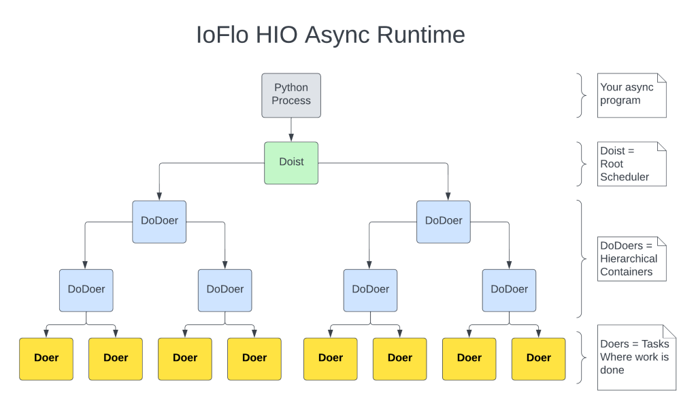

# HIO LEARNING NOTES:

## TODO
- [ ] start with base.tyming
## Kent Bull
https://kentbull.com/2024/05/11/keri-internals-part-1-concurrency-and-async-programming-with-the-hio-async-framework-and-i-o-library/

Summary: HIO (Hierarchical IO) is an asynchronous runtime and input/output (IO) framework written by Dr. Samuel Smith that supports cooperative multitasking using [Classic Coroutines](https://www.fluentpython.com/extra/classic-coroutines/)  and asyncchonous buffers for I/O. Allows for nesting subtasks within tasks.

> A Python **coroutine** is essentially a generator driven by calls to its .send(…) method.   
> - In a coroutine, the essential meaning of "to yield" is to give way—to hand control to some other part of the program, and wait until notified to resume. The caller invokes my_coroutine.send(datum) to push data into the coroutine. The coroutine then resumes and gets datum as the value of the yield expression where it was suspended. In normal usage, a caller repeatedly pushes data into the coroutine in that way. In contrast with generators, coroutines are usually data consumers, not producers.   

> **classic coroutines**  
> > A generator function that consumes data sent to it via my_coro.send(data) calls, and reads that data by using yield in an expression. Classic coroutines can delegate to other classic coroutines using yield from.  
---
### Python’s AsyncIO package
#### Native coroutines – async/await
`async` def syntax to define a function, introduced with [PEP-492](https://peps.python.org/pep-0492/) in Python 3.5 (2015).
```python
import asyncio
import time
 
# Native coroutine - uses the "async def" syntax to define a function
async def print_after(delay, what):
    await asyncio.sleep(delay)
    print(time.strftime('%X'),what)
 
# An asyncio-compatible main function
async def main():
    print(f"started at {time.strftime('%X')}")
    await print_after(1, 'hello')
    await print_after(2, 'world')
    print(f"finished at {time.strftime('%X')}")
 
# The asyncio task scheduler - uses the default asyncio event loop
asyncio.run(main())
```
output:
```bash
started at 05:01:57
05:01:58 hello
05:02:00 world
finished at 05:02:00
```

## HIO main Classes
* Doist - root scheduler
* DoDoer - heirachichal container of a Doer and DoDoer instances.
* Doer - main task class. Core task concept in HIO. coroutine

## Async abstractions:
- **event loop**
- **task or coroutine**
- **scheduler**
- queues
- futures
- callbacks
- non-blocking i/o
- synchonization primitives ( locks, semaphores)
- timeouts anc acancellation
- notion of lifecyled for tasks

## Cooperative multitasking
Each coroutine yields control to a central scheduler (`Doist`).


## classical coroutines keywords
A few keywords distinguish classical coroutines including:

* `yield`: used to pause execution of a coroutine (generator function), send a value out of a coroutine, and receive a value into a coroutine.  
* `yield from`: used when nesting generators (inner generators) to pause execution of the outer generator and pass, or delegate, conrol to a sub-generator. Once the sub-generator completes then control is passed back to the outer generator.  
    * The `yield from` keyword is very similar to the `await` keyword from AsyncIO. Both drive sub-generators and both allow consumption of values returned by sub-generators.  
    * `await` does not completely replace `yield from` because `await` must be used inside a native coroutine and must be used with an awaitable object.  
    * `yield from` can be used in any function and with any iterable.  
## hio heirarchy


